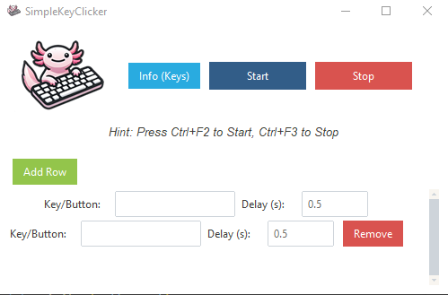

# SimpleKeyClicker

**SimpleKeyClicker** is a simple automated keyboard and mouse action tool. It allows you to configure a sequence of key presses and mouse clicks (with a delay in between) and then repeatedly execute them until stopped. Ideal for repetitive tasks like data entry, testing workflows, or gaming macros.



## Features

- Create a sequence of keyboard and mouse actions.
- Configure delays between each action.
- Add or remove rows of actions dynamically.
- Start/Stop the automation with a button click or via hotkeys:
  - **Start:** Ctrl+F2
  - **Stop:** Ctrl+F3
- View possible keys/actions through an "Info" dialog.
- Modern, themed UI using `ttkbootstrap`.

## Download

**[Download the latest Windows EXE here](https://github.com/timoinglin/SimpleKeyClicker/releases/latest)**


## Usage

1. **Run from Source:**
   - Make sure you have Python 3.8+ installed.
   - Install dependencies:
     ```bash
     pip install pydirectinput ttkbootstrap keyboard
     ```
   - Run the tool:
     ```bash
     python main.py
     ```

2. **Run the EXE:**
   - Download the `SimpleKeyClicker.exe` from the [releases page](https://github.com/timoinglin/SimpleKeyClicker/releases/latest).
   - Double-click `SimpleKeyClicker.exe` to start.

## Customizing / Editing the Code

You can clone the repo and modify `main.py` to adjust behavior, add new keys, or change the UI.

```bash
git clone https://github.com/timoinglin/SimpleKeyClicker.git
cd SimpleKeyClicker
python main.py
