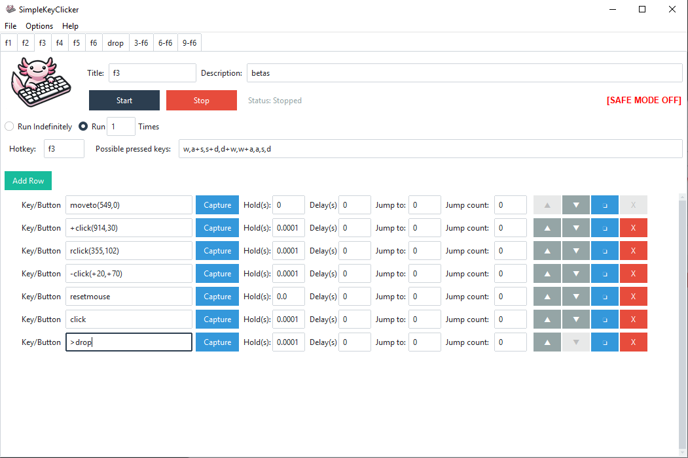

# SimpleKeyClicker

A powerful and user-friendly GUI automation tool for simulating keyboard and mouse inputs. Built with Python and ttkbootstrap. Perfect for gaming macros, testing, or automating repetitive input tasks.




## Features

-   🎮 **Action Sequencing**: Create and run sequences of keyboard presses and mouse actions.
-   ⏱️ **Customizable Timing**: Set delays *after* each action and specify hold durations for keys/mouse buttons.
-   🔄 **Repetition Control**: Choose to run sequences **indefinitely** or for a **specific number of times**.
[//]: <> (-   🎨 **Theme Support**: Toggle between **Light** (Flatly) and **Dark** (Darkly) themes via the Options menu.)
-   🖱️ **Advanced Mouse Control**: Perform clicks and movements at specific screen coordinates (`moveto(x,y)`, `click(x,y)`, etc.).
-   🎯 **Coordinate/Color Capture**: Built-in tool to capture mouse coordinates (X,Y) and screen pixel color (R,G,B) with a single click.
-   🎨 **Color Detection**: Pause script execution until a specific color appears at designated coordinates (`waitcolor`).
    -   Includes **robust error handling**: Pauses automation and shows a clear error message if the color isn't found within the timeout, preventing infinite loops.
-   ⌨️ **Reliable Typing**: Type strings accurately, preserving case and handling symbols (`Hello World!`, `user@example.com`, etc.).
-   💾 **Save/Load Configurations**: Save your sequences and run settings (repetition mode/count) to JSON files and load them back anytime via the File menu.
-   🛡️ **Safety Features**:
    -   **Safe Mode** (toggleable via Options menu) prevents potentially disruptive keys/commands.
    -   **Emergency Stop** (ESC key) immediately halts execution.
-   💡 **Visual Feedback**:
    -   The currently executing row is highlighted.
    -   Row status indicators show progress (► running, ✓ completed).
    -   Status bar displays overall state (Stopped, Running, Loop Count, Completed, Emergency Stop).
-   ⚙️ **UI Organization**:
    -   Tabbed iterface support, with each sequence per tab
    -   Clean interface with primary controls (Start/Stop) readily available.
    -   File operations, Options (Safe Mode, Theme), and Help are neatly organized in a **top menu bar**.
    -   Action rows feature intuitive controls for **moving up/down**, **duplicating**, and **removing**.
-   ⌨️ **Global Hotkeys**: Start (`Ctrl+F2`), Stop (`Ctrl+F3`), and Emergency Stop (`ESC`) from anywhere (requires admin/root privileges on some systems).
-   ℹ️ **Info Panel**: Detailed, formatted help window explaining all possible keys and commands (accessible from the Help menu).


## Installation

1.  **Prerequisites**: Ensure you have Python 3.7+ installed.
2.  **Clone the repository** (Optional, if you have the code directly, skip this):
    ```bash
    git clone https://github.com/yourusername/SimpleKeyClicker.git
    cd SimpleKeyClicker
    ```
3.  **Install dependencies**:
    It's recommended to use a virtual environment:
    ```bash
    python -m venv venv
    # On Windows:
    venv\Scripts\activate
    # On macOS/Linux:
    # source venv/bin/activate
    ```
    Install the required packages:
    ```bash
    pip install -r requirements.txt
    ```

## Quick Start

1.  Run the application:
    ```bash
    python main.py
    ```
    1.1.    CLI arguments can be specified to open single or multiple JSON configs - f2.json, f3.json, etc. (extensions will be added automatically):
    ```bash
    python main.py f2 f3 f4
    ```
2.  Click "**Add Row**" to create steps for your sequence.
3.  For each row:
    *   Enter a **Key/Button** or command (see Help > Show Keys/Actions Info).
    *   Use "**Capture**" to easily get coordinates/colors for commands like `moveto`, `click(x,y)`, `waitcolor`.
    *   Set the **Hold Time** (how long a key/button is held down, 0.0 for a simple press/click).
    *   Set the **Delay** (pause *after* the action completes).
    *   Jump to support:
        * **Jump to**: editbox allows to jump to a defined row at a step. Works only if `jumpcount` > 0.
        * **Jumcount**: editbox specifies count of jump repetitions.
        * `Jump to` and `Jumpcount` can be used only once per automation, i.e. don't specify these parameteres more than for only one row in a sequence.
        > [!CAUTION]
        > Using `Jump to` and `Jumpcount` can cause your automation to infinite loop. It is not recommended to use these functions, only in case of extreme need.
4.  Use the **▲**, **▼**, **❏**, **X** buttons on each row to organize your sequence.
5.  Select the desired **Run Mode**: "Run Indefinitely" or "Run X Times" (enter the number of repetitions).
6.  **(Optional)** Go to **File > Save Configuration** to store your setup.
7.  Click "**Start**" or press `Ctrl+F2` to begin automation.
8.  Click "**Stop**" or press `Ctrl+F3` (or `ESC`) to halt automation.

## Available Actions (Key/Button Field)

*(Refer to **Help > Show Keys/Actions Info** in the app for detailed, formatted explanations)*

**Basic Keyboard Input:**
*   Single letters (`a`, `b`), digits (`1`, `2`), symbols (`!`, `@`, `,`). Handled by `pyautogui.write` for reliability.
*   Special keys: `tab`, `space`, `enter`, `esc`, `backspace`, `delete`, `up`, `down`, `left`, `right`, `home`, `end`, `pageup`, `pagedown`, `f1`...`f12`, etc. Handled by `pydirectinput.press`.
*   Modifier Keys (use `Hold Time > 0`): `shift`, `ctrl`, `alt`, `win` (Windows key). Handled by `pydirectinput.keyDown`/`keyUp`.
*   Any unrecognized text is typed out using `pyautogui.write` (e.g., `Hello World!`).
*   `+`, `-` are now excluded from recognised symbols.

**Basic Mouse Input (Current Cursor Position):**
*   `click` (Left click)
*   `rclick` (Right click)
*   `mclick` (Middle click)
    *(Use `Hold Time > 0` to hold the click)*

**Advanced Mouse Input (Specific Coordinates):**
*   `moveto(x,y)`: Moves the mouse cursor to screen coordinates (X, Y).
*   `click(x,y)`: Moves to (X, Y) and performs a left click.
*   `rclick(x,y)`: Moves to (X, Y) and performs a right click.
*   `mclick(x,y)`: Moves to (X, Y) and performs a middle click.
    *(Use `Hold Time > 0` with these to hold the click at the specified position)*

**Keydown & Keyup input**
*   `+`: modifier before singlekey command modifies behaviour to fire keydown event, i.e: `+ctrl` will fire ctrl keydown event. Must be freed with any row firing keyup event (see next).
*   `-`: modifier before singlekey command modifies behaviour to fike keyup event, i.e.: `-ctrl` will release ctrl key, after fired before keydown event.
> [!WARNING]
> Every single `+` keydown event must be completed with `-` release event, i.e. `+crtl`, ... do something ..., `-ctrl`, ....


**Color Detection:**
*   `waitcolor(r,g,b,x,y)`: Pauses execution until the color (R, G, B) is detected at screen coordinates (X, Y).
    *   **Behavior**: If the color is not found within the timeout (~30 seconds), a **modal error dialog** appears, pausing the script. Automation **stops** after you click "OK" on the dialog.

**Reset Mouse Position:**
*   `resetmouse`: restores mouse position as it was on the moment of starting key automation.

## Safety Features

### Safe Mode
*   Enabled by default (toggle via **Options > Safe Mode** in the menu).
*   Blocks potentially disruptive keys (`alt`, `ctrl`, `shift`, `win`, `f4`, `delete`, `tab`) and commands (`waitcolor`).
*   Provides an extra layer of safety, especially when testing new sequences.

### Emergency Stop
*   Pressing the `ESC` key at any time will immediately halt the automation sequence.
*   The application status will update, and a confirmation dialog will appear.

### Global Hotkeys
*   `Ctrl+F2`: Start the automation sequence - default hotkey.
*   `anyhotkey`: hotkey will be specified as opened JSON config filename, can be one of `f1-f6, up, down`. Don't use wrong filenames!
*   `Ctrl+F3`: Stop the automation sequence gracefully.
*   `ESC`: Emergency stop (immediate halt).
    *(Note: May require administrator/root privileges to register)*

## Tips and Best Practices

1.  **Test Thoroughly**: Always test new or complex sequences, preferably with **Safe Mode** enabled initially.
2.  **Use 'Capture'**: The `Capture` button is the easiest way to get accurate coordinates and colors for commands.
3.  **Understand `waitcolor`**: Be aware that it will *stop* the script if the color isn't found within the timeout. Ensure the target color/coordinates are correct.
4.  **Appropriate Delays**: Add sufficient `Delay` between actions, especially those that rely on UI changes or animations to complete.
5.  **Save Often**: Use **File > Save Configuration** to back up your automation configurations.
6.  **Start Simple**: Build complex sequences incrementally.

## Requirements

*   Python 3.7+
*   ttkbootstrap>=1.10.1
*   keyboard>=0.13.5
*   PyDirectInput>=1.0.4
*   pyautogui>=0.9.54
*   Pillow>=10.0.0
*   pynput>=1.7.6

## Contributing

Contributions are welcome! Feel free to submit issues, fork the repository, and create pull requests for improvements or bug fixes.

## License

MIT License

Copyright (c) 2025 Timo Inglin

Permission is hereby granted, free of charge, to any person obtaining a copy
of this software and associated documentation files (the "Software"), to deal
in the Software without restriction, including without limitation the rights
to use, copy, modify, merge, publish, distribute, sublicense, and/or sell
copies of the Software, and to permit persons to whom the Software is
furnished to do so, subject to the following conditions:

The above copyright notice and this permission notice shall be included in all
copies or substantial portions of the Software.

THE SOFTWARE IS PROVIDED "AS IS", WITHOUT WARRANTY OF ANY KIND, EXPRESS OR
IMPLIED, INCLUDING BUT NOT LIMITED TO THE WARRANTIES OF MERCHANTABILITY,
FITNESS FOR A PARTICULAR PURPOSE AND NONINFRINGEMENT. IN NO EVENT SHALL THE
AUTHORS OR COPYRIGHT HOLDERS BE LIABLE FOR ANY CLAIM, DAMAGES OR OTHER
LIABILITY, WHETHER IN AN ACTION OF CONTRACT, TORT OR OTHERWISE, ARISING FROM,
OUT OF OR IN CONNECTION WITH THE SOFTWARE OR THE USE OR OTHER DEALINGS IN THE
SOFTWARE.

## Acknowledgments

-   UI built with the modern **ttkbootstrap** library.
-   Input simulation primarily powered by **PyDirectInput** and **PyAutoGUI**.
-   Screen interaction and color detection via **PyAutoGUI** and **Pillow (PIL)**.
-   Global hotkeys managed by **keyboard**.
-   Mouse coordinate/color capture uses **pynput**.