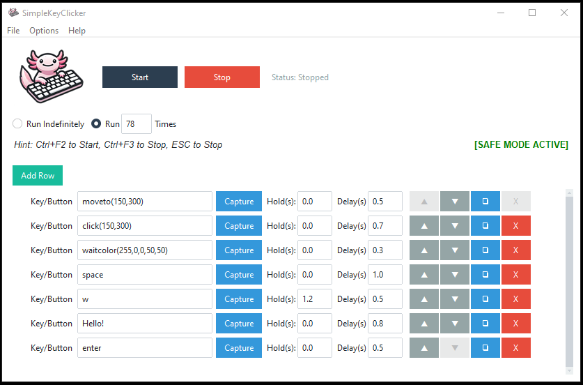

# SimpleKeyClicker


A powerful and user-friendly GUI automation tool for simulating keyboard and mouse inputs. Built with Python and ttkbootstrap. Perfect for gaming macros, testing, or automating repetitive input tasks.



---

## Key Features

*   **Action Sequencing**: Create and run sequences of keyboard presses and mouse actions.
*   **Repetition Control**: Run sequences indefinitely or for a specific number of times.
*   **Customizable Timing**: Set delays *after* each action and specify hold durations.
*   **Theme Support**: Toggle between Light (Flatly) and Dark (Darkly) themes.
*   **Advanced Mouse Control**: Perform clicks and movements at specific screen coordinates (`moveto(x,y)`, `click(x,y)`).
*   **Coordinate/Color Capture**: Easily capture mouse coordinates (X,Y) and screen pixel color (R,G,B) with a single click.
*   **Color Detection**: Pause execution until a specific color appears at designated coordinates (`waitcolor`) with timeout error handling.
*   **Reliable Typing**: Type strings accurately, preserving case and handling symbols.
*   **Save/Load Configurations**: Save/Load sequences and run settings (repetition mode/count) to JSON files.
*   **Safety Features**: Toggleable Safe Mode and Emergency Stop (ESC key).
*   **Visual Feedback**: Highlights the current row, shows loop counts, and overall status.
*   **Organized UI**: Clean layout with a menu bar for less frequently used actions.
*   **Global Hotkeys**: Start (`Ctrl+F2`), Stop (`Ctrl+F3`), and Emergency Stop (`ESC`).

---

## Download

Get the latest release directly from the **[GitHub Releases Page](https://github.com/timoinglin/SimpleKeyClicker/releases/latest)**.

*(Look for the `.exe` file for Windows)*

---

## Quick Start

1.  Download and run the `.exe` file from the [latest release](https://github.com/timoinglin/SimpleKeyClicker/releases/latest).
2.  Click "**Add Row**" to create steps for your sequence.
3.  For each row:
    *   Enter a **Key/Button** or command (see **Help > Show Keys/Actions Info** in the app).
    *   Use "**Capture**" to easily get coordinates/colors for commands like `moveto`, `click(x,y)`, `waitcolor`.
    *   Set the **Hold Time** and **Delay**.
4.  Use the **▲**, **▼**, **❏**, **X** buttons on each row to organize your sequence.
5.  Select the desired **Run Mode**: "Run Indefinitely" or "Run X Times".
6.  **(Optional)** Go to **File > Save Configuration**.
7.  Click "**Start**" or press `Ctrl+F2`.
8.  Click "**Stop**" or press `Ctrl+F3` (or `ESC`).

---

## Building from Source (Optional)

1.  Ensure Python 3.7+ is installed.
2.  Clone the repository: `git clone https://github.com/timoinglin/SimpleKeyClicker.git`
3.  Navigate to the directory: `cd SimpleKeyClicker`
4.  Create and activate a virtual environment (recommended):
    ```bash
    python -m venv venv
    # On Windows: venv\Scripts\activate
    # On macOS/Linux: source venv/bin/activate
    ```
5.  Install dependencies: `pip install -r requirements.txt`
6.  Run the application: `python main.py`

---

## Repository

Find the full source code and contribute on **[GitHub](https://github.com/timoinglin/SimpleKeyClicker)**. 